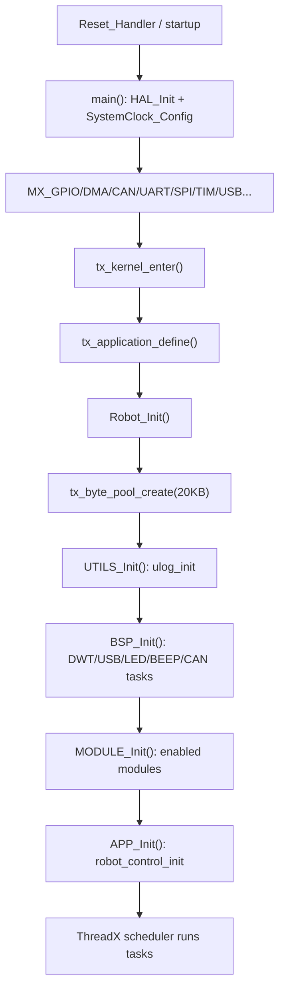
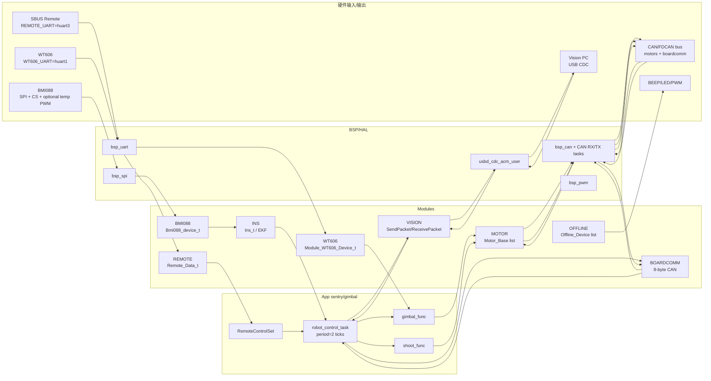
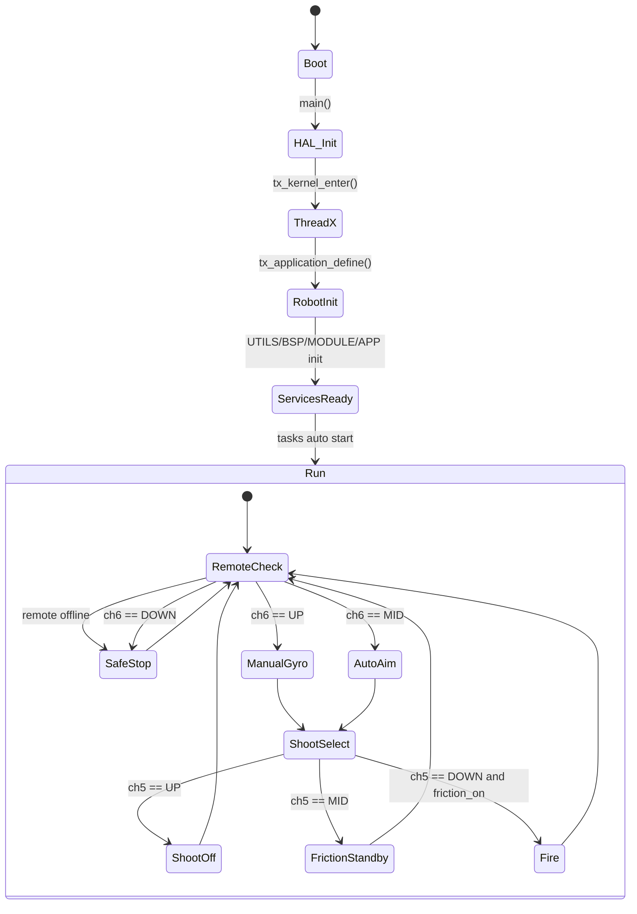

# mas_embedded_threadx 全局索引

> 生成依据：当前仓库源码；默认构建配置为 `apps/config.cmake` 中 `ROBOT=sentry`、`BOARD=gimbal`。注意：这里的 `BOARD` 指机器人板型角色（`single/gimbal/chassis`），硬件平台由 CMake 源目录 `board/damiao_h7` 或 `board/dji_c` 决定。

## 1. 🚀 工程概述 (Project Overview)

- **芯片型号/平台**
  - `board/damiao_h7/`：STM32H723xx，Cortex-M7，ThreadX 架构变量 `THREADX_ARCH=cortex_m7`，DWT 初始化频率 480 MHz。
  - `board/dji_c/`：STM32F407xx，Cortex-M4，ThreadX 架构变量 `THREADX_ARCH=cortex_m4`，DWT 初始化频率 168 MHz。
- **编译/开发环境**
  - CMake `>=3.22` + Ninja + `arm-none-eabi-gcc` 工具链。
  - 板级入口：`cmake -S board/damiao_h7 ...` 或 `cmake -S board/dji_c ...`。
  - IDE 辅助：`.vscode/`、`.zed/`；调试/烧录脚本在对应目录下。
  - 第三方/中间件：Eclipse ThreadX、STM32 HAL/CMSIS、CMSIS-DSP、CherryUSB。
- **核心功能简述**
  - 面向 RoboMaster 多兵种/多板型的 ThreadX 嵌入式机器人控制框架。
  - 默认目标为哨兵云台板：采集遥控、BMI088/WT606 姿态、视觉 USB 数据，通过 CAN 控制 DJI/达妙电机，并与底盘板进行 8 字节 CAN 板间通信。
  - 架构按 `BSP -> modules -> app` 分层，CMake 通过 `ROBOT/BOARD` 条件编译模块和业务代码。

### CMake 构建主线

```text
board/<platform>/CMakeLists.txt
  -> include apps/config.cmake
      -> include modules/module_config.cmake
      -> include apps/<ROBOT>/robot.cmake
      -> set SINGLE/GIMBAL/CHASSIS_BOARD
      -> set MODULE_<NAME>
  -> include apps/generate_headers.cmake
      -> build/generated/robot_def.h
      -> build/generated/module_config.h
  -> add_subdirectory(stm32cubemx, threadx, utils, board/bsp, robot, modules, apps, CMSIS-DSP)
  -> link base.elf = stm32cubemx + threadx + utils + bsp + robot + modules + app + CMSISDSP + cherryusb
```

默认 `sentry/gimbal` 生成的关键开关：

| 宏/变量 | 值 | 来源 | 影响 |
| :--- | :--- | :--- | :--- |
| `ROBOT` | `sentry` | `apps/config.cmake` | 选择 `apps/sentry/robot.cmake` |
| `BOARD` | `gimbal` | `apps/config.cmake` | 编译 `apps/sentry/gimbal_board/**` |
| `GIMBAL_BOARD` | `1` | `apps/config.cmake` | 应用/板间通信按云台板分支 |
| `MODULES_GIMBAL` | `OFFLINE REMOTE BMI088 INS WT606 MOTOR VISION BOARDCOMM` | `apps/sentry/robot.cmake` | 默认启用模块 |
| `REMOTE_UART` | `huart3` | `apps/sentry/robot.cmake` | 遥控输入串口 |
| `REMOTE_SOURCE` | `1` | `apps/sentry/robot.cmake` | SBUS |
| `REMOTE_VT_SOURCE` | `0` | `apps/sentry/robot.cmake` | 图传遥控禁用 |
| `WT606_UART` | `huart1` | `apps/sentry/robot.cmake` | WT606 串口 |
| `BOARDCOMM_CAN` | `BSP_CAN_HANDLE2` | `apps/sentry/robot.cmake` | 板间 CAN2 |

## 2. 📁 目录树与文件映射 (Directory Tree)

> 第三方/厂商树（HAL、CMSIS-DSP、ThreadX、CherryUSB）文件量很大，目录树按工程边界折叠；自有代码和关键构建文件完整展开到模块/关键文件级。

```text
mas_embedded_threadx/
├─ README.md                         # 项目说明
├─ project_index.md                  # 全局索引
├─ .clang-format                     # 格式规则
├─ .clang-tidy                       # 静态检查
├─ .clangd                           # clangd 配置
├─ .gitignore                        # 忽略规则
├─ .github/workflows/ci_build.yml    # CI 构建
├─ .vscode/                          # VS Code 任务
│  ├─ tasks.json                     # 构建/烧录任务
│  ├─ launch.json                    # 调试配置
│  ├─ settings.json                  # IDE 设置
│  └─ flash_interactive.*            # 交互烧录
├─ .zed/                             # Zed 任务
│  ├─ tasks.json                     # 构建/烧录任务
│  ├─ settings.json                  # IDE 设置
│  └─ flash_*.*                      # 烧录脚本
├─ apps/                             # 应用层
│  ├─ CMakeLists.txt                 # 应用代码收集
│  ├─ config.cmake                   # ROBOT/BOARD 选择
│  ├─ generate_headers.cmake         # 生成配置头
│  ├─ app_init.c/.h                  # 应用入口
│  ├─ infantry3/                     # 步兵3业务
│  │  ├─ robot.cmake                 # 模块配置
│  │  ├─ infantry_def.h              # 业务定义
│  │  └─ single_board/               # 单板控制
│  │     ├─ robot_control.c/.h       # 主应用线程
│  │     ├─ chassis/                 # 底盘逻辑
│  │     ├─ gimbal_func/             # 云台逻辑
│  │     ├─ robot_func/              # 遥控映射
│  │     └─ shoot_func/              # 发射逻辑
│  ├─ sentry/                        # 哨兵业务
│  │  ├─ robot.cmake                 # 模块配置
│  │  ├─ sentry_def.h                # 协议/状态定义
│  │  ├─ gimbal_board/               # 云台板业务
│  │  │  ├─ robot_control.c/.h       # 默认主线程
│  │  │  ├─ gimbal_func/             # 云台电机控制
│  │  │  ├─ robot_func/              # 遥控到命令
│  │  │  └─ shoot_func/              # 摩擦轮/拨弹
│  │  └─ chassis_board/              # 底盘板业务
│  │     ├─ robot_control.c/.h       # 底盘主线程
│  │     ├─ chassis/                 # 底盘运动
│  │     └─ robot_func/              # 业务辅助
│  └─ templates/                     # 新机器人模板
│     ├─ robot.cmake                 # 配置模板
│     ├─ robot_def.h                 # 定义模板
│     ├─ single_board/               # 单板模板
│     ├─ gimbal_board/               # 云台模板
│     └─ chassis_board/              # 底盘模板
├─ board/                            # 板级支持
│  ├─ bsp/                           # 通用 BSP
│  │  ├─ CMakeLists.txt              # BSP 库
│  │  ├─ bsp_def.h                   # 内存/Cache 宏
│  │  ├─ bsp_init.c/.h               # BSP 初始化
│  │  ├─ BEEP/                       # 蜂鸣器 PWM
│  │  ├─ CAN/                        # CAN/FDCAN BSP
│  │  │  ├─ bsp_can.c/.h             # CAN 设备/过滤器
│  │  │  └─ bsp_can_task.c/.h        # CAN 收发线程
│  │  ├─ DWT/                        # DWT 计时
│  │  ├─ FLASH/                      # 内置/OSPI Flash
│  │  ├─ GPIO/                       # EXTI 回调注册
│  │  ├─ I2C/                        # I2C DMA/事件
│  │  ├─ LED/                        # RGB LED
│  │  ├─ PWM/                        # PWM 抽象
│  │  ├─ SPI/                        # SPI DMA/IT 抽象
│  │  ├─ UART/                       # UART DMA+IDLE
│  │  └─ USB/                        # CherryUSB CDC 用户层
│  ├─ damiao_h7/                     # STM32H723 平台
│  │  ├─ CMakeLists.txt              # H7 构建入口
│  │  ├─ CMakePresets.json           # H7 预设
│  │  ├─ base.ioc                    # CubeMX 配置
│  │  ├─ startup_stm32h723xx.s       # 启动文件
│  │  ├─ STM32H723XG_FLASH.ld        # 链接脚本
│  │  ├─ cmake/                      # 工具链/CubeMX
│  │  ├─ Core/Inc/                   # HAL 头文件
│  │  ├─ Core/Src/                   # HAL 源文件
│  │  └─ Drivers/                    # HAL/CMSIS
│  └─ dji_c/                         # STM32F407 平台
│     ├─ CMakeLists.txt              # F4 构建入口
│     ├─ CMakePresets.json           # F4 预设
│     ├─ base.ioc                    # CubeMX 配置
│     ├─ startup_stm32f407xx.s       # 启动文件
│     ├─ STM32F407XX_FLASH.ld        # 链接脚本
│     ├─ cmake/                      # 工具链/CubeMX
│     ├─ Inc/                        # HAL 头文件
│     ├─ Src/                        # HAL 源文件
│     └─ Drivers/                    # HAL/CMSIS
├─ modules/                          # 功能模块层
│  ├─ CMakeLists.txt                 # 条件编译模块
│  ├─ module_config.cmake            # 默认模块参数
│  ├─ module_init.c/.h               # 模块初始化
│  ├─ MODULES.MD                     # 模块规范
│  ├─ algorithm/                     # PID/LQR/CRC等
│  ├─ OFFLINE/                       # 离线检测
│  ├─ REMOTE/                        # 遥控/图传输入
│  ├─ BMI088/                        # BMI088 IMU
│  ├─ INS/                           # 姿态解算 EKF
│  ├─ REFEREE/                       # 裁判系统
│  ├─ MOTOR/                         # 电机控制框架
│  ├─ VISION/                        # 视觉 USB 协议
│  ├─ BOARDCOMM/                     # 板间 CAN
│  ├─ SuperCap/                      # 超级电容
│  ├─ WT606/                         # WT606 串口 IMU
│  └─ template/                      # 模块模板
├─ robot/                            # 系统初始化层
│  ├─ CMakeLists.txt                 # robot 库
│  └─ robot_init.c/.h                # 总初始化
├─ utils/                            # 通用工具
│  ├─ CMakeLists.txt                 # utils 库
│  ├─ utils_init.c/.h                # 工具初始化
│  ├─ ulog/                          # RTT 日志
│  ├─ kfifo/                         # 环形 FIFO
│  └─ list/                          # 链表工具
├─ threadx/                          # Eclipse ThreadX
│  ├─ CMakeLists.txt                 # RTOS 构建
│  ├─ tx_user.h                      # ThreadX 配置
│  ├─ common/                        # RTOS 内核
│  └─ ports/                         # Cortex-M 端口
├─ CherryUSB/                        # USB 协议栈
├─ CMSIS-DSP/                        # DSP 数学库
├─ docs/                             # 文档
└─ build/                            # 构建产物
```

## 3. ⚙️ 硬件外设与引脚分配 (Hardware & GPIO Mapping)

### STM32H723 平台 (`board/damiao_h7`)

| 外设 (Peripheral) | 引脚 (Pin) | 传输协议/模式 (Mode) | 对应驱动文件 (Driver File) | 备注 (Note) |
| :--- | :--- | :--- | :--- | :--- |
| 电源使能 | PC13 `POWER_24V_2` | GPIO 输出 | `board/bsp/bsp_init.c` | BSP 初始化拉低 |
| 电源使能 | PC14 `POWER_24V_1` | GPIO 输出 | `board/bsp/bsp_init.c` | BSP 初始化拉低 |
| 电源使能 | PC15 `POWER_5V` | GPIO 输出 | `board/bsp/bsp_init.c` | BSP 初始化拉高 |
| 用户按键 | PA15 `USER_KEY` | GPIO 输入 | `board/damiao_h7/Core/Src/gpio.c` | 未注册业务回调 |
| MCO | PA8 | RCC_MCO_1 | `board/damiao_h7/Core/Src/gpio.c` | 输出 HSI |
| ADC1 | PC4 | ADC1_INP4 + DMA1_Stream0 | `board/damiao_h7/Core/Src/adc.c` | 连续转换 |
| FDCAN1 | PD0/PD1 | RX/TX | `board/damiao_h7/Core/Src/fdcan.c`, `board/bsp/CAN/bsp_can.c` | CAN 设备抽象 |
| FDCAN2 | PB5/PB6 | RX/TX | `board/damiao_h7/Core/Src/fdcan.c`, `board/bsp/CAN/bsp_can.c` | 默认板间通信 |
| FDCAN3 | PD12/PD13 | RX/TX | `board/damiao_h7/Core/Src/fdcan.c`, `board/bsp/CAN/bsp_can.c` | H7 额外 CAN |
| UART5 | PC12/PD2 | TX/RX 100000 | `board/damiao_h7/Core/Src/usart.c`, `board/bsp/UART/bsp_uart.c` | SBUS 候选 |
| UART7 | PE8/PE7 | TX/RX 921600 | `board/damiao_h7/Core/Src/usart.c`, `board/bsp/UART/bsp_uart.c` | 通用串口 |
| USART1 | PA9/PA10 | TX/RX 921600 | `board/damiao_h7/Core/Src/usart.c`, `board/bsp/UART/bsp_uart.c` | 默认 WT606 |
| USART2 | PD5/PD6 + PD4 DE | RS485/UART 921600 | `board/damiao_h7/Core/Src/usart.c` | DE 使能 |
| USART3 | PD8/PD9 + PB14 DE | RS485/UART 921600 | `board/damiao_h7/Core/Src/usart.c` | 默认 REMOTE_UART |
| USART10 | PE3/PE2 | TX/RX 921600 | `board/damiao_h7/Core/Src/usart.c` | 通用串口 |
| SPI2 | PB13/PC2/PC1 | SCK/MISO/MOSI + DMA | `board/damiao_h7/Core/Src/spi.c`, `board/bsp/SPI/bsp_spi.c` | BMI088 总线 |
| BMI088 ACC CS | PC0 `ACC_CS` | GPIO 输出 | `modules/BMI088/module_bmi088.c` | SPI2 加速度计片选 |
| BMI088 GYRO CS | PC3 `GYRO_CS` | GPIO 输出 | `modules/BMI088/module_bmi088.c` | SPI2 陀螺仪片选 |
| BMI088 ACC INT | PE10 `ACC_INT` | EXTI 上升沿 | `board/damiao_h7/Core/Src/gpio.c` | 未见业务回调 |
| BMI088 GYRO INT | PE12 `GYRO_INT` | EXTI 上升沿 | `board/damiao_h7/Core/Src/gpio.c` | 未见业务回调 |
| BMI088 温控 | PB1 | TIM3_CH4 PWM | `modules/BMI088/module_bmi088.c`, `board/bsp/PWM/bsp_pwm.c` | `BMI088_TEMP_ENABLE` 控制 |
| RGB LED | PA5/PA7 | SPI6 SCK/MOSI | `board/bsp/LED/bsp_led.c` | WS2812 编码输出 |
| 蜂鸣器 | PB15 | TIM12_CH2 PWM | `board/bsp/BEEP/bsp_beep.c` | 离线报警可用 |
| PWM | PE9/PE13 | TIM1_CH1/CH3 | `board/damiao_h7/Core/Src/tim.c` | 通用 PWM |
| PWM | PA0/PA2 | TIM2_CH1/CH3 | `board/damiao_h7/Core/Src/tim.c` | 通用 PWM |
| I2C2 | PB10/PB11 | SCL/SDA + DMA RX | `board/damiao_h7/Core/Src/i2c.c`, `board/bsp/I2C/bsp_i2c.c` | 7-bit 地址 |
| OCTOSPI2 | PA1/PA3/PB0/PB2/PE11/PD11 | OSPI | `board/damiao_h7/Core/Src/octospi.c`, `board/bsp/FLASH/bsp_flash.c` | W25Qxx 支持 |
| USB HS | USB_OTG_HS | CDC ACM | `board/damiao_h7/Core/Src/usb_otg.c`, `board/bsp/USB/usbd_cdc_acm_user.c` | CherryUSB + ThreadX |

### STM32F407 平台 (`board/dji_c`)

| 外设 (Peripheral) | 引脚 (Pin) | 传输协议/模式 (Mode) | 对应驱动文件 (Driver File) | 备注 (Note) |
| :--- | :--- | :--- | :--- | :--- |
| MAG_RST | PG6 | GPIO 输出 | `board/dji_c/Src/gpio.c` | 磁力计复位 |
| KEY | PA0 | EXTI0 下降沿 | `board/dji_c/Src/gpio.c`, `board/bsp/GPIO/bsp_gpio.c` | 用户键 |
| INT_MAG | PG3 | EXTI3 下降沿 | `board/dji_c/Src/gpio.c` | 磁力计中断 |
| BMI088 ACC CS | PA4 `CS1_ACCEL` | GPIO 输出 | `modules/BMI088/module_bmi088.c` | SPI1 加速度计片选 |
| BMI088 GYRO CS | PB0 `CS1_GYRO` | GPIO 输出 | `modules/BMI088/module_bmi088.c` | SPI1 陀螺仪片选 |
| BMI088 ACC INT | PC4 `INT_ACC` | EXTI4 下降沿 | `board/dji_c/Src/gpio.c` | IMU 中断 |
| BMI088 GYRO INT | PC5 `INT_GYRO` | EXTI9_5 下降沿 | `board/dji_c/Src/gpio.c` | IMU 中断 |
| BMI088 温控 | PF6 | TIM10_CH1 PWM | `modules/BMI088/module_bmi088.c` | 温控 PWM |
| CAN1 | PD0/PD1 | RX/TX | `board/dji_c/Src/can.c`, `board/bsp/CAN/bsp_can.c` | 标准 CAN |
| CAN2 | PB5/PB6 | RX/TX | `board/dji_c/Src/can.c`, `board/bsp/CAN/bsp_can.c` | 默认板间通信 |
| USART1 | PA9/PB7 | TX/RX 921600 | `board/dji_c/Src/usart.c`, `board/bsp/UART/bsp_uart.c` | WT606 默认 |
| USART3 | PC10/PC11 | TX/RX 100000 | `board/dji_c/Src/usart.c`, `board/bsp/UART/bsp_uart.c` | SBUS 默认 |
| USART6 | PG14/PG9 | TX/RX 115200 | `board/dji_c/Src/usart.c`, `board/bsp/UART/bsp_uart.c` | 图传/裁判候选 |
| SPI1 | PB3/PB4/PA7 | SCK/MISO/MOSI + DMA | `board/dji_c/Src/spi.c`, `board/bsp/SPI/bsp_spi.c` | BMI088 总线 |
| SPI2 | PB13/PB14/PB15 | SCK/MISO/MOSI | `board/dji_c/Src/spi.c`, `board/bsp/SPI/bsp_spi.c` | 通用 SPI |
| I2C2 | PF1/PF0 | SCL/SDA + DMA | `board/dji_c/Src/i2c.c`, `board/bsp/I2C/bsp_i2c.c` | 通用 I2C |
| I2C3 | PA8/PC9 | SCL/SDA | `board/dji_c/Src/i2c.c`, `board/bsp/I2C/bsp_i2c.c` | 通用 I2C |
| RGB LED | PH10/PH11/PH12 | TIM5_CH1/2/3 PWM | `board/bsp/LED/bsp_led.c` | C 板 RGB |
| LED_R/G/B 宏 | PH12/PH11/PH10 | GPIO 宏定义 | `board/dji_c/Inc/main.h` | 实际 LED 走 TIM5 |
| 蜂鸣器 | PD14 | TIM4_CH3 PWM | `board/bsp/BEEP/bsp_beep.c` | 离线报警可用 |
| IMU_TEMP 宏 | PF6 | GPIO 宏定义/PWM | `board/dji_c/Inc/main.h`, `tim.c` | 实际为 TIM10_CH1 |
| DAC | PA5 | DAC_OUT2 | `board/dji_c/Src/dac.c` | 模拟输出 |
| USB FS | PA12/PA11/PA10 | DP/DM/ID | `board/dji_c/Src/usb_otg.c`, `board/bsp/USB/usbd_cdc_acm_user.c` | `OTG_FS_IRQHandler` 在 it.c 中注释 |

## 4. 🧩 软件模块与架构关系 (Software Modules & Architecture)

### 分层清单

- **硬件/驱动层 (BSP/Hardware)**
  - CubeMX/HAL：`board/damiao_h7/Core/Src/*.c`、`board/dji_c/Src/*.c`；负责时钟、GPIO、DMA、CAN/FDCAN、UART、SPI、I2C、TIM、USB、ADC 等硬件初始化。
  - BSP 抽象：`board/bsp/**`
    - `CAN/bsp_can.c`：CAN 设备注册、过滤器、RX/TX FIFO、HAL 回调入队。
    - `CAN/bsp_can_task.c`：CAN RX/TX ThreadX 后台任务。
    - `UART/bsp_uart.c`：UART DMA + IDLE 接收、事件标志同步。
    - `SPI/bsp_spi.c`：SPI 设备/总线互斥、DMA/IT/阻塞传输。
    - `I2C/bsp_i2c.c`：I2C 设备/总线互斥、事件标志同步。
    - `PWM/bsp_pwm.c`：PWM 设备、占空比/PSC/Pulse 设置。
    - `GPIO/bsp_gpio.c`：EXTI 回调注册表。
    - `USB/usbd_cdc_acm_user.c`：CDC ACM 初始化、收发缓冲。
    - `DWT/bsp_dwt.c`：微秒级计时/延时。
  - 内存/Cache：`board/bsp/bsp_def.h`
    - H7 栈放 `dtcmram`，DMA buffer 放 `RAM_D1` 并 32 字节对齐。
    - F4 栈放 `ccmram`，DMA buffer 放 `ram` 并 32 字节对齐。

- **功能/中间件层 (Middleware/Service)**
  - `modules/OFFLINE`：设备离线链表、10 tick 周期检测、可蜂鸣报警。
  - `modules/REMOTE`：SBUS/DT7/VT02/VT03 解码，统一输出 `Remote_Data_t`。
  - `modules/BMI088`：SPI 读写 BMI088，加速度/陀螺仪/温度，温控 PWM。
  - `modules/INS`：读取 BMI088，Quaternion EKF 姿态解算，输出 `Ins_t`。
  - `modules/WT606`：UART 解析 WT606/WT901 11 字节帧，输出姿态/四元数/连续 yaw。
  - `modules/MOTOR`：电机抽象，DJI/达妙/舵机/ZDT 驱动，PID/LQR 控制。
  - `modules/VISION`：USB CDC 视觉协议，`SendPacket`/`ReceivePacket`。
  - `modules/BOARDCOMM`：云台/底盘 CAN 8 字节板间协议。
  - `modules/REFEREE`、`modules/SuperCap`：裁判系统/超级电容；默认 `sentry/gimbal` 未启用。

- **应用逻辑层 (App)**
  - `apps/app_init.c`：调用 `robot_control_init()`。
  - 默认：`apps/sentry/gimbal_board/robot_control.c`
    - 创建 `robot_control_thread`，优先级 30，栈 1024。
    - 每 2 tick 执行遥控映射、视觉收发、云台控制、发射控制、板间通信。
  - `apps/sentry/gimbal_board/robot_func/robot_func.c`
    - 将遥控通道映射为 `Chassis_Ctrl_Cmd_t`、`Gimbal_Ctrl_Cmd_t`、`Shoot_Ctrl_Cmd_t`。
  - `apps/sentry/gimbal_board/gimbal_func/gimbal_func.c`
    - 初始化大 yaw、小 yaw、pitch 电机；执行零力/陀螺/自动模式。
  - `apps/sentry/gimbal_board/shoot_func/shoot_func.c`
    - 初始化左右摩擦轮和拨弹电机；执行关闭/待发/单发/连发。

### 初始化顺序



### 默认 `sentry/gimbal` 数据流



### 默认云台/发射控制逻辑

- `RemoteControlSet()`：
  - `Module_Remote_get_offline_status() & 0x01` 为真时认为遥控在线。
  - 通道 2/1 映射底盘 `vx/vy`，通道 8 选择底盘模式。
  - 通道 6：上档 `gimbal_gyro_mode`，中档 `gimbal_auto_mode + chassis_automode`，下档零力并关闭发射。
  - 通道 5/7 控制发射开关、摩擦轮、单发/连发。
  - 遥控离线时置零力/关闭，并清零底盘命令。
- `gimbal_func()`：
  - 离线检测通过后才控制三电机。
  - `gimbal_zero_force`：停止大 yaw、小 yaw、pitch。
  - `gimbal_gyro_mode`：大 yaw 跟随小 yaw 机械偏移，小 yaw/pitch 使用遥控参考。
  - `gimbal_auto_mode`：根据 `auto_search` 做目标跟踪、搜索正弦 pitch、归零。
- `shoot_func()`：
  - 三个发射电机均在线才执行。
  - `shoot_on + friction_on`：摩擦轮 `+/-6800 rpm`，拨弹根据 `load_mode` 输出 `0/-4000/-8000 rpm`。
  - 其他情况停止或置零参考。
- `Module_BoardComm`：
  - 云台板：TX ID `0x310`，RX ID `0x311`。
  - 底盘板：TX ID `0x311`，RX ID `0x310`。
  - 默认云台板发送 `GimbalToChassis_cmd_t`，接收 `ChassisToGimbal_referee_t`。

## 5. 🔑 核心全局变量、宏定义与状态机 (Global Context & State Machine)

### 关键结构体 (Structs)

| 类型 | 文件 | 关键字段/职责 |
| :--- | :--- | :--- |
| `Offline_Init_config_t` / `Offline_Device` | `modules/OFFLINE/module_offline.h`, `.c` | 设备名、超时、蜂鸣次数、在线状态链表 |
| `Remote_Data_t` | `modules/REMOTE/module_remote.h` | `channels[16]`、鼠标、键盘、DT7/VT03 自定义数据 |
| `Bmi088_device_t` | `modules/BMI088/module_bmi088.h` | SPI 设备、温控 PWM、PID、acc/gyro/temp、校准数据 |
| `Ins_t` | `modules/INS/module_ins.h` | 四元数、机体/导航系加速度、欧拉角、连续 yaw、dt |
| `Module_WT606_Device_t` | `modules/WT606/module_wt606.h` | acc/gyro/euler/quat、连续 yaw、UART 设备、离线设备 |
| `Motor_Init_Config_s` | `modules/MOTOR/motor_def.h` | 控制器、设置、电机类型、离线配置、CAN/UART/PWM transport |
| `Motor_Base` | `modules/MOTOR/motor_base.h` | 电机链表节点、测量、控制器、transport、`ControlAndSend()` |
| `Can_Device` / `CAN_Bus_Manager` | `board/bsp/CAN/bsp_can.h` | CAN 设备、过滤器槽、RX/TX FIFO、总线状态 |
| `SendPacket` / `ReceivePacket` | `modules/VISION/module_vision.h` | USB 视觉发送/接收协议包 |
| `Gimbal_Ctrl_Cmd_t` | `apps/sentry/sentry_def.h` | yaw/pitch/auto_search/gimbal_mode |
| `Shoot_Ctrl_Cmd_t` | `apps/sentry/sentry_def.h` | shoot/load/friction 模式 |
| `Chassis_Ctrl_Cmd_t` | `apps/sentry/sentry_def.h` | vx/vy/wz/offset/chassis_mode |
| `GimbalToChassis_cmd_t` | `apps/sentry/sentry_def.h` | 8 字节云台到脚盘命令 |
| `ChassisToGimbal_referee_t` | `apps/sentry/sentry_def.h` | 8 字节底盘到云台裁判摘要 |

### 全局变量/标志位 (Globals)

| 变量 | 文件 | 作用 |
| :--- | :--- | :--- |
| `TX_BYTE_POOL tx_app_byte_pool` | `robot/robot_init.c`, `board/bsp/bsp_def.h` | 20KB 应用字节池；`BSP_MEM_ALLOC_WAIT` 使用 |
| `g_can_bus[BSP_CAN_BUS_NUM]` | `board/bsp/CAN/bsp_can.c` | CAN/FDCAN 总线管理器数组 |
| `g_can_rx_sem`, `g_can_tx_sem` | `board/bsp/CAN/bsp_can_task.c` | CAN ISR/任务同步信号量 |
| `uart_device_table[]` | `board/bsp/UART/bsp_uart.c` | UART 设备池 |
| `spi_bus_table[]` | `board/bsp/SPI/bsp_spi.c` | SPI 总线状态/互斥/事件 |
| `i2c_bus_table[]` | `board/bsp/I2C/bsp_i2c.c` | I2C 总线状态/互斥/事件 |
| `bmi088_device` | `modules/BMI088/module_bmi088.c` | BMI088 单例 |
| `ins` | `modules/INS/module_ins.c` | INS 姿态单例，通过 `Module_INS_get()` 只读暴露 |
| `QEKF_INS` | `modules/INS/QuaternionEKF.c/.h` | 姿态 EKF 内部状态 |
| `g_remote_data` | `modules/REMOTE/module_remote.c` | 遥控统一数据单例 |
| `wt606_device` | `modules/WT606/module_wt606.c` | WT606 单例 |
| `g_motor_list` | `modules/MOTOR/motor_base.c` | 所有电机链表头 |
| `sender_assignment[]` | `modules/MOTOR/DJI/motor_dji.c` | DJI 电机分组发送帧缓存 |
| `rx_packet` | `modules/VISION/module_vision.c` | 最近一次有效视觉接收包 |
| `boardcomm_dev`, `boardcomm_offline_dev` | `modules/BOARDCOMM/module_boardcomm.c` | 板间通信 CAN 设备/离线句柄 |
| `gimbal_cmd`, `shoot_cmd`, `chassis_cmd` | `apps/sentry/gimbal_board/robot_control.c` | 默认应用主循环命令缓存 |
| `big_yaw_motor`, `small_yaw_motor`, `pitch_motor` | `apps/sentry/gimbal_board/gimbal_func/gimbal_func.c` | 云台电机句柄 |
| `friction_l`, `friction_r`, `loader` | `apps/sentry/gimbal_board/shoot_func/shoot_func.c` | 发射电机句柄 |

### 核心宏定义

| 宏 | 文件 | 值/作用 |
| :--- | :--- | :--- |
| `TX_MAX_PRIORITIES` | `threadx/tx_user.h` | 32 |
| `TX_TIMER_TICKS_PER_SECOND` | `threadx/tx_user.h` | 1000 |
| `TX_TIMER_PROCESS_IN_ISR` | `threadx/tx_user.h` | 定时器到期在 ISR 处理 |
| `TX_DISABLE_STACK_FILLING` | `threadx/tx_user.h` | 禁用栈填充 |
| `TX_DISABLE_PREEMPTION_THRESHOLD` | `threadx/tx_user.h` | 禁用抢占阈值 |
| `TX_DISABLE_NOTIFY_CALLBACKS` | `threadx/tx_user.h` | 禁用 notify callbacks |
| `TX_NOT_INTERRUPTABLE` | `threadx/tx_user.h` | ThreadX 内部不可中断优化 |
| `APPS_STACK_SECTION` | `board/bsp/bsp_def.h` | H7 `.dtcmram`；F4 `.ccmram` |
| `BUFFER_SECTION` | `board/bsp/bsp_def.h` | DMA buffer 对齐区域 |
| `BSP_CAN_BUS_NUM` | `board/bsp/CAN/bsp_can.h` | H7=3，F4=2 |
| `BSP_CAN_HANDLE1/2/3` | `board/bsp/CAN/bsp_can.h` | 映射 FDCAN/CAN HAL 句柄 |
| `STATE_ONLINE/OFFLINE` | `modules/OFFLINE/module_offline.h` | 0/1 |
| `SBUS_CHX_BIAS/UP/DOWN` | `modules/REMOTE/module_remote.h` | 1024/240/1807 |
| `BOARDCOMM_GIMBAL_ID` | `modules/BOARDCOMM/module_boardcomm.h` | `0x310` |
| `BOARDCOMM_CHASSIS_ID` | `modules/BOARDCOMM/module_boardcomm.h` | `0x311` |
| `SMALL_YAW_ALIGN_ECD` | `apps/sentry/sentry_def.h` | 4692 |
| `YAW_CHASSIS_ALIGN_ECD` | `apps/sentry/sentry_def.h` | 4096 |
| `CHASSIS_MAX_SPEED_MPS` | `apps/sentry/sentry_def.h` | 3.0 |

### 核心状态机 (FSM)



状态枚举来源：

- `gimbal_mode_e`：`gimbal_zero_force`、`gimbal_gyro_mode`、`gimbal_auto_mode`。
- `shoot_mode_e`：`shoot_off`、`shoot_on`。
- `friction_mode_e`：`friction_off`、`friction_on`。
- `loader_mode_e`：`load_stop`、`load_reverse`、`load_1_bullet`、`load_burstfire`。
- `chassis_mode_e`：`chassis_zero_force`、`chassis_follow_gimbal_yaw`、`chassis_rotate`、`chassis_rotate_reverse`、`chassis_automode`。

## 6. ⚡ 中断服务与实时性任务 (Interrupts & Tasks)

### ThreadX 任务/同步对象

| 任务/对象 | 创建位置 | 栈 | 优先级 | 周期/触发 | 处理逻辑 |
| :--- | :--- | :--- | :--- | :--- | :--- |
| `CAN RX Task` | `board/bsp/CAN/bsp_can_task.c` | 1024 | 3 | `g_can_rx_sem` | 从各 CAN RX FIFO 取帧，按 `rx_id` 调设备回调 |
| `CAN TX Task` | `board/bsp/CAN/bsp_can_task.c` | 1024 | 4 | `g_can_tx_sem` | 从各 CAN TX FIFO 取帧，调用 HAL 发送 |
| `Offline Detect` | `modules/OFFLINE/module_offline.c` | `OFFLINE_TASK_STACK_SIZE=1024` | 6 | `tx_thread_sleep(10)` | 检测设备超时，控制蜂鸣报警/看门狗 |
| `INS Task` | `modules/INS/module_ins.c` | `INS_TASK_STACK_SIZE=1024` | 7 | `tx_thread_sleep(1)` | 读 BMI088，更新 Quaternion EKF，输出姿态 |
| `Remote VT` | `modules/REMOTE/module_remote.c` | 1024 | 8 | `tx_thread_sleep(100)` | 图传遥控解码；默认 `REMOTE_VT_SOURCE=0` 不工作 |
| `Remote Ctrl` | `modules/REMOTE/module_remote.c` | 1024 | 9 | `tx_thread_sleep(100)` | SBUS/DT7 解码到 `g_remote_data` |
| `wt606` | `modules/WT606/module_wt606.c` | 1024 | 8 | UART 阻塞读 + sleep 10 | 解析 WT606 帧，更新 yaw/quat |
| `vision_thread` | `modules/VISION/module_vision.c` | 1024 | 10 | USB CDC 接收轮询 | 查找 `0xBB ... 0x55` 包并更新 `rx_packet` |
| `motor` | `modules/MOTOR/module_motor.c` | 1024 | 12 | `tx_thread_sleep(2)` | 遍历 `g_motor_list`，执行每个电机 `ControlAndSend()` |
| `robot_control_thread` | `apps/sentry/gimbal_board/robot_control.c` | 1024 | 30 | `tx_thread_sleep(2)` | 默认应用主循环 |
| `tx_app_byte_pool` | `robot/robot_init.c` | 20KB | N/A | 全局内存池 | BSP/模块动态分配 |
| `uart_evt/spi_evt/i2c_evt/pwm_evt` | 对应 BSP 文件 | N/A | N/A | HAL 完成回调置位 | DMA/IT 传输同步 |

### 硬中断 (ISR)

#### STM32H723 (`board/damiao_h7/Core/Src/stm32h7xx_it.c`)

| ISR | 触发源 | 处理落点 |
| :--- | :--- | :--- |
| `TIM23_IRQHandler` | HAL tick timebase | `HAL_TIM_IRQHandler` -> `HAL_IncTick()` |
| `FDCAN1_IT0/IT1_IRQHandler` | FDCAN1 RX/错误等 | HAL -> `HAL_FDCAN_RxFifo0/1Callback` -> `bsp_can.c` 入 FIFO |
| `FDCAN2_IT0/IT1_IRQHandler` | FDCAN2 RX/错误等 | 同上 |
| `FDCAN3_IT0/IT1_IRQHandler` | FDCAN3 RX/错误等 | 同上 |
| `USART1/2/3/10_IRQHandler` | UART 中断/IDLE | HAL -> `bsp_uart.c` 回调 |
| `UART5_IRQHandler` | UART5 中断/IDLE | HAL -> `bsp_uart.c` 回调 |
| `UART7_IRQHandler` | UART7 中断/IDLE | HAL -> `bsp_uart.c` 回调 |
| `SPI2_IRQHandler` | SPI2 传输 | HAL -> `bsp_spi.c` 完成/错误回调 |
| `SPI6_IRQHandler` | SPI6 传输 | HAL -> `bsp_spi.c` 完成/错误回调 |
| `I2C2_EV_IRQHandler` | I2C2 事件 | HAL -> `bsp_i2c.c` 完成回调 |
| `OTG_HS_IRQHandler` | USB HS | HAL/CherryUSB 处理 |
| `ADC_IRQHandler` | ADC1 | HAL ADC |
| `OCTOSPI2_IRQHandler` | OSPI2 | HAL OSPI |
| `MDMA_IRQHandler`, `BDMA_Channel0_IRQHandler` | MDMA/BDMA | HAL DMA |
| `DMA1_Stream0..7_IRQHandler` | DMA1 streams | HAL DMA |
| `DMA2_Stream0..7_IRQHandler` | DMA2 streams | HAL DMA |

#### STM32F407 (`board/dji_c/Src/stm32f4xx_it.c`)

| ISR | 触发源 | 处理落点 |
| :--- | :--- | :--- |
| `TIM8_TRG_COM_TIM14_IRQHandler` | HAL tick timebase | `HAL_TIM_IRQHandler` -> `HAL_IncTick()` |
| `CAN1_RX0/RX1_IRQHandler` | CAN1 RX FIFO | HAL -> `HAL_CAN_RxFifo0/1MsgPendingCallback` -> `bsp_can.c` |
| `CAN2_RX0/RX1_IRQHandler` | CAN2 RX FIFO | 同上 |
| `USART1/3/6_IRQHandler` | UART 中断/IDLE | HAL -> `bsp_uart.c` 回调 |
| `SPI1_IRQHandler`, `SPI2_IRQHandler` | SPI 传输 | HAL -> `bsp_spi.c` 回调 |
| `I2C2_EV/ER_IRQHandler` | I2C2 事件/错误 | HAL -> `bsp_i2c.c` |
| `I2C3_EV/ER_IRQHandler` | I2C3 事件/错误 | HAL -> `bsp_i2c.c` |
| `EXTI0_IRQHandler` | KEY PA0 | HAL GPIO EXTI -> `bsp_gpio.c` 注册回调 |
| `EXTI3_IRQHandler` | INT_MAG PG3 | HAL GPIO EXTI |
| `EXTI4_IRQHandler` | INT_ACC PC4 | HAL GPIO EXTI |
| `EXTI9_5_IRQHandler` | INT_GYRO PC5 | HAL GPIO EXTI |
| `DMA1_Stream1/2/7_IRQHandler` | DMA1 streams | HAL DMA |
| `DMA2_Stream0/2/3/5/6/7_IRQHandler` | DMA2 streams | HAL DMA |
| `OTG_FS_IRQHandler` | USB FS | 在 `stm32f4xx_it.c` 中被注释；CubeMX 仍初始化 NVIC |

### HAL 回调与异步边界

| 回调 | 文件 | 作用 |
| :--- | :--- | :--- |
| `HAL_FDCAN_RxFifo0/1Callback` | `board/bsp/CAN/bsp_can.c` | H7 FDCAN 收包入 FIFO，释放 RX 信号量 |
| `HAL_CAN_RxFifo0/1MsgPendingCallback` | `board/bsp/CAN/bsp_can.c` | F4 CAN 收包入 FIFO，释放 RX 信号量 |
| `HAL_UARTEx_RxEventCallback` | `board/bsp/UART/bsp_uart.c` | UART IDLE/DMA 接收完成，置事件标志 |
| `HAL_UART_TxCpltCallback` | `board/bsp/UART/bsp_uart.c` | UART 发送完成，置事件标志 |
| `HAL_SPI_Tx/Rx/TxRxCpltCallback` | `board/bsp/SPI/bsp_spi.c` | SPI 传输完成，置事件标志 |
| `HAL_SPI_ErrorCallback` | `board/bsp/SPI/bsp_spi.c` | SPI 错误，置错误事件 |
| `HAL_I2C_MasterTx/RxCpltCallback` | `board/bsp/I2C/bsp_i2c.c` | I2C 主机传输完成 |
| `HAL_I2C_MemTx/RxCpltCallback` | `board/bsp/I2C/bsp_i2c.c` | I2C memory 传输完成 |
| `HAL_TIM_PWM_PulseFinishedCallback` | `board/bsp/PWM/bsp_pwm.c` | PWM DMA/IT 输出完成 |
| `HAL_GPIO_EXTI_Callback` | `board/bsp/GPIO/bsp_gpio.c` | 调度注册的 EXTI 回调 |

### 实时性注意点

- ThreadX tick 为 1000 Hz，`tx_thread_sleep(1)` 约 1 ms。
- 默认控制链路：
  - INS：1 ms 更新。
  - Motor：2 ms 更新所有已注册电机。
  - App：2 ms 生成控制命令。
  - Offline：10 ms 检测设备心跳。
  - Remote：100 ms 解码任务 sleep，但实际接收由 UART DMA/IDLE 缓冲驱动。
- H7 开启 D-Cache，DMA buffer 必须使用 `BUFFER_SECTION` 或显式 `BSP_CACHE_CLEAN/INVALIDATE`。
- CAN 发送不是直接在业务线程阻塞 HAL，而是进入 TX FIFO 后由 `CAN TX Task` 发送；接收由 ISR 入 FIFO 后 `CAN RX Task` 分发到模块回调。
